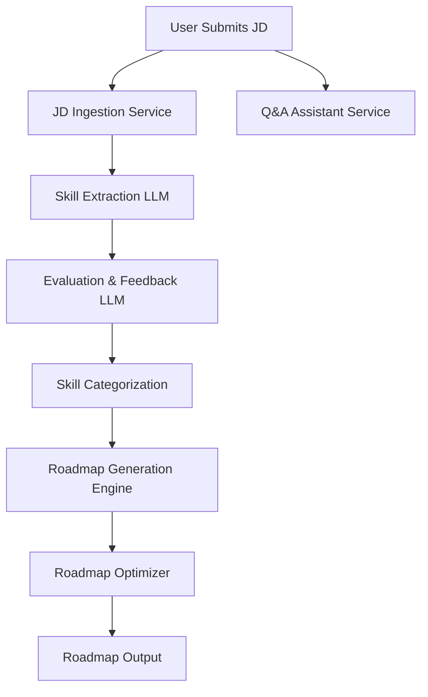

# 📐 Detailed Design Document: Skill-based Roadmap Generator with LLM

---

## 🧱 1. Architecture Overview

**Microservices Architecture**: The system is designed with multiple independent services communicating via APIs.

### 🧩 Core Components:

* **Job Description Ingestion Service**
* **Skill Extraction LLM Service**
* **Evaluation & Feedback LLM Service** ✅ *(New)*
* **Skill Categorization & Mapping Service**
* **Roadmap Generation Engine**
* **Roadmap Optimizer (via LLM)**
* **User Interaction Service (Web UI/API)**
* **General Q\&A Assistant Service** ✅ *(New)*

### 🔁 Flow:

1. User submits a job description.
2. Skill Extraction LLM extracts and categorizes skills.
3. **Evaluation LLM compares multiple outputs for quality and selects the best.** ✅
4. Roadmap Generation Engine maps skills to learning plans.
5. Optimizer improves roadmap using expert heuristics and LLM suggestions.
6. Q\&A Assistant answers prep questions.
7. All responses logged and refined iteratively.

---

## 🧩 2. Component Details

### 📄 2.1 Job Description Ingestion Service

* Accepts job descriptions via UI or API
* Validates and preprocesses text (tokenization, normalization)

### 🧠 2.2 Skill Extraction LLM Service

* Uses LLM to extract:

  * Technical Skills
  * Soft Skills
  * Domain-Specific Skills
  * Certifications
  * Experience Requirements
* Prompts optimized for completeness and clarity

### 🤖 2.3 Evaluation & Feedback LLM Service ✅ *(New)*

* **Takes multiple outputs from the Skill Extraction and Roadmap Generation services**
* Evaluates each output on:

  * Coverage
  * Accuracy
  * Relevance to the role
  * Specificity
* Selects the best version or merges into a refined output
* Uses a secondary model like Claude or GPT-4 Turbo for independent critique

### 🗂️ 2.4 Skill Categorization & Mapping

* Groups extracted skills into standardized categories
* Maps them to internal skill trees (e.g., DSA → Algorithms → Recursion, Sorting)
* Adds metadata (difficulty, prerequisites, estimated time to learn)

### 🛤️ 2.5 Roadmap Generation Engine

* Generates a phased learning path based on extracted skills
* Considers user profile (experience level, preferred pace, learning style)
* Produces modular output:

  * Phase-wise breakdown (Foundations → Projects → Interview)
  * Resources (links to courses, books, videos)
  * Milestones

### 🔧 2.6 Roadmap Optimizer

* Refines the roadmap using:

  * LLM-based critique
  * Patterns from successful user journeys
  * Expert templates (e.g., Google SWE roadmap)
* Adjusts timelines and inserts checkpoints

### 💬 2.7 Q\&A Assistant Service ✅ *(New)*

* Powered by a tuned LLM
* Handles:

  * Explanations of skills
  * Clarifications on roadmap steps
  * Suggestions for alternative paths
  * Behavioral prep and soft skill development
* Context-aware, supports follow-up questions

### 🌐 2.8 User Interface Service

* Web app with:

  * Job input form
  * Editable roadmap viewer
  * Chat interface with Q\&A assistant
  * Roadmap progress tracker

---

## 🛢️ 3. Data Flow

---

## 🧪 4. Model Usage

* **LLMs Involved:**

  * GPT-4 Turbo for extraction and generation
  * Claude/GPT for evaluation and critique
* **Prompt Engineering:**

  * Few-shot examples for each skill type
  * Self-refinement loops

---

## 🧠 5. Intelligence Layer

* Evaluates multiple generations
* Learns from user ratings and preferences
* Dynamic roadmap tuning based on:

  * Time constraints
  * Feedback
  * Confidence levels from LLMs

---

## ✅ 6. Output Features

* Roadmaps downloadable as PDF/Markdown
* Roadmaps updatable on new JD
* Dynamic Q\&A support
* Quality-assured outputs via peer-evaluated LLM chains ✅

---

## 🔐 7. Security & Ethics

* All API calls secure with OAuth2 / JWT
* PII stripped before LLM interaction
* User control over data sharing
* Human-in-the-loop overrides where needed

---

## 📦 8. Tech Stack

* **Frontend**: React + TailwindCSS
* **Backend**: Node.js + Express
* **LLM Layer**: LLM API
* **DB**: MongoDB
* **Auth**: Firebase Auth / Auth0

---

## 📅 9. Milestones

1. Skill Extraction + Categorization ✅
2. Roadmap Generator ✅
3. Q\&A Service ✅
4. Evaluation & Critique Pipeline ✅
5. UI Integration + Testing
6. User Feedback Loop
7. Deployment

---
