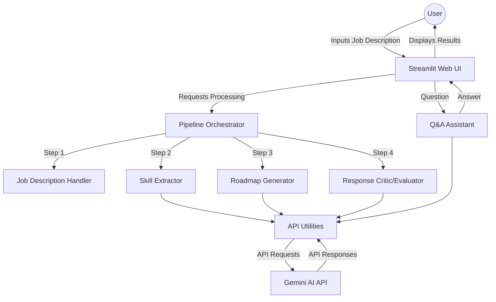
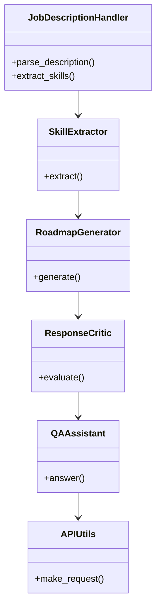
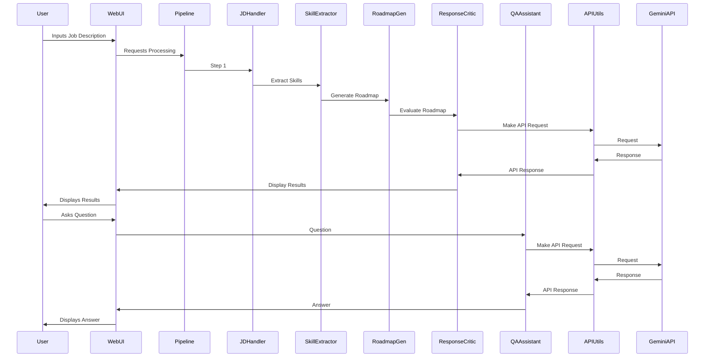

# Career Roadmap Generator

A comprehensive application that uses AI to analyze job descriptions, extract skills, and generate personalized learning roadmaps. This project leverages the Gemini API to provide career guidance and learning plans tailored to specific job roles.

## 📋 Table of Contents

- [Features](#features)
- [System Architecture](#system-architecture)
- [Installation](#installation)
- [Usage](#usage)
- [Running Tests](#running-tests)
- [Testing Methodology](#testing-methodology)
- [Project Structure](#project-structure)
- [API Key Configuration](#api-key-configuration)
- [UML Diagrams](#uml-diagrams)
- [Contributing](#contributing)

## ✨ Features

- **Job Description Analysis**: Extract key skills and requirements from job descriptions
- **Skill Categorization**: Automatically categorize skills into technical, soft, domain-specific, etc.
- **Personalized Learning Roadmap**: Generate phase-wise learning roadmaps with resources and projects
- **Roadmap Evaluation**: Evaluate and improve roadmaps using AI feedback
- **Interactive Q&A**: Ask questions about your roadmap and receive tailored guidance
- **Download Options**: Export your roadmap in JSON or Markdown format

## 🏗️ System Architecture



## 🚀 Installation

### Prerequisites

- Python 3.8+
- Gemini API key

### Setup Instructions

1. Clone the repository:

```bash
git clone https://github.com/hrishirajmitra/Job-Helper.git
cd Job-Helper
```

2. Install dependencies:

```bash
pip install -r requirements.txt
```

3. Set up your Gemini API key:

Create a `.env` file in the root directory with the following content:

```plaintext
GEMINI_API_KEY=your_api_key_here
```

## 📊 Usage

### Running the Web Application

To launch the Streamlit web application:

```bash
streamlit run app.py
```

This will start the server and open the application in your default web browser. If it doesn't open automatically, navigate to `http://localhost:8501`.

### Using the Command-line Interface

You can also run the pipeline directly from the command line:

```bash
# Process a job description from text
python pipeline.py --input "Your job description here"

# Process a job description from a file
python pipeline.py --file path/to/job_description.txt

# Process and start interactive Q&A mode
python pipeline.py --file path/to/job_description.txt --interactive
```

### Example Workflow

1. Paste a job description or use the sample provided
2. Click "Generate Roadmap"
3. Explore the extracted skills, roadmap, and evaluation
4. Ask questions about your roadmap in the Q&A tab
5. Download your roadmap in JSON or Markdown format

## 🧪 Running Tests

### Running the Complete Test Suite

To run all tests:

```bash
cd Job-Helper
python -m tests.run_tests
```

### Running Specific Tests

To run tests for a specific component:

```bash
python -m tests.test_job_description_handler
python -m tests.test_skill_extractor
python -m tests.test_roadmap_generator
python -m tests.test_response_critic
python -m tests.test_qa_assistant
python -m tests.test_api_utils
python -m tests.test_pipeline
```

### Test Coverage

To check test coverage (requires the `coverage` package):

```bash
pip install coverage
coverage run -m tests.run_tests
coverage report -m
```

To generate an HTML coverage report:

```bash
coverage html
# This creates a directory htmlcov/ with the report
```

## 🧪 Testing Methodology

### Testing Approach

The Career Roadmap Generator follows a comprehensive testing strategy:

1. **Unit Testing**: Each component is tested in isolation with mock dependencies
2. **Integration Testing**: Verifies proper interactions between components
3. **Error Handling Testing**: Validates robust error handling throughout the system

### Test Design Patterns

- **Mocking**: External API calls to Gemini are mocked to avoid network dependencies
- **Dependency Injection**: Components accept dependencies that can be replaced with mocks for testing
- **Fixtures**: Common test data is centralized in fixtures for reuse
- **Parameterized Tests**: Multiple scenarios can be tested with the same test function

### Test Implementation

Each module has a corresponding test module that:
- Tests the happy path (expected functionality)
- Tests error handling (responses to invalid inputs)
- Tests edge cases (boundary conditions)

The tests make extensive use of Python's `unittest` framework with `unittest.mock` for mocking external dependencies.

## 📁 Project Structure

The project structure is as follows:

```plaintext
Job-Helper/
├── app.py
├── pipeline.py
├── requirements.txt
├── .env.example
├── README.md
├── tests/
│   ├── __init__.py
│   ├── run_tests.py
│   ├── test_job_description_handler.py
│   ├── test_skill_extractor.py
│   ├── test_roadmap_generator.py
│   ├── test_response_critic.py
│   ├── test_qa_assistant.py
│   ├── test_api_utils.py
│   └── test_pipeline.py
└── src/
    ├── __init__.py
    ├── job_description_handler.py
    ├── skill_extractor.py
    ├── roadmap_generator.py
    ├── response_critic.py
    ├── qa_assistant.py
    ├── api_utils.py
    └── pipeline.py
```

## 🔑 API Key Configuration

To use the Gemini API, you need to set up your API key. Follow these steps:

1. Create a `.env` file in the root directory of the project.
2. Add your Gemini API key to the `.env` file:

```plaintext
GEMINI_API_KEY=your_api_key_here
```

## 📊 UML Diagrams

### Class Diagram



### Sequence Diagram



## 🤝 Contributing

Contributions are welcome! Please read the [contributing guidelines](CONTRIBUTING.md) first.
